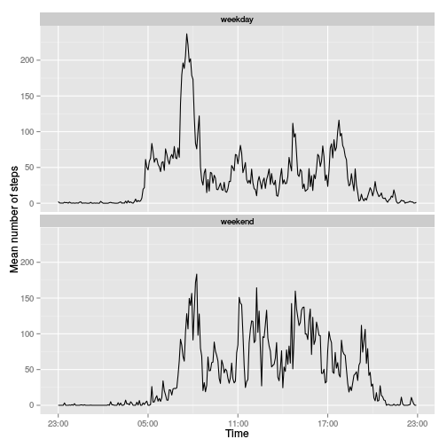

Adapted from [rdpeng's template](https://github.com/rdpeng/RepData_PeerAssessment1)

Compiled using the command:
```
knit2html("PA1_template.Rmd","PA1_template.html")
# N.B. not a knitr R block.
```


```r
  # Some knitr housekeeping and libraries
  library(knitr)
  library(dplyr)
```

```
## 
## Attaching package: 'dplyr'
## 
## The following objects are masked from 'package:stats':
## 
##     filter, lag
## 
## The following objects are masked from 'package:base':
## 
##     intersect, setdiff, setequal, union
```

```r
  library(ggplot2)
  library(scales)
  opts_chunk$set(echo=TRUE)
```

## Loading and preprocessing the data
Data cover the range 2012-10-30 to 2012-11-30.

We loaded the included activity.zip (same as available from the assignment via coursera as repdata\_data\_activity.zip). The
interval labels were found to be 24hr clock times with leading
zeros ommitted. (If you notice plateaus in your interval plots the
gap from 55th minute of one hour, xx55, to 0th minute of the next,
yy00, is the reason.)

```r
# The activity.zip in source control matches exactly the
# repdata_data_activity.zip downloadable from Coursera.
unzip("activity.zip")
activity <- read.csv("activity.csv",
                     colClasses=c("numeric","Date","numeric"),
                     na.strings = "NA")

# This is really quite horrible. There are 24*60=1440 minutes
# in a day, 24*12 = 288 five minute intervals. But the five minute
# intervals range [0 2355], with 288 distinct values. It's actually
# an unformatted time. Since:
# 1. It spans a likely daylight savings change.
# 2. This course is running in October and daylight savings might
#    hit a careless conversion
# 3. Plotting them as is introduces nonlinear gaps from xx55 -> yy00
# I'm just going to calculate as if all intervals are times on the
# first day of the period.
activity <- activity %>%
  mutate(intervaltime=as.POSIXct(
    sprintf("2012-10-01 %04d",interval), format="%Y-%m-%d %H%M")
  )


# Define some helper functions 
# Determine optimum breaks for a histogram from data x. If
# nbins not supplied then use one of the nclass. functions.
findBreaks <- function (x, nclass.meth=nclass.Sturges,
                           nbins) {
  if (missing(nbins)) {
    nbins <- nclass.meth(x)
  }
  breaks <- seq(from=min(x), to=max(x),
      along.with = 0:nbins)
}
```

Sanity check, our date range is expected to be 2012-10-01 to
2012-11-30.

```r
 c(min(as.Date(activity$date)), max(as.Date(activity$date)))
```

```
## [1] "2012-10-01" "2012-11-30"
```

## What is mean total number of steps taken per day?

### Histograms of the total number of steps taken each day

```r
# Calculate the total number of steps taken per day
dailyActivity <- activity %>% group_by(date) %>%
  summarise(steps=sum(steps, na.rm=TRUE))

# Going to plot two histograms, so use a function to do it
doHisto <- function (activity, breaks, title=NULL) {
    # Adapt example from ggplot2 documentation
    qplot(steps, data=dailyActivity, xlab="Daily steps",
        breaks=breaks,
        geom="histogram", fill=..count..) +
    scale_fill_gradient("Count", low = "blue", high = "red") +
    labs(title=title)
}

breaks <- findBreaks(dailyActivity$steps)
doHisto(dailyActivity, breaks,
        "Total daily steps, missing values ignored")
```

 

```r
# Though I sort of like 10...
breaks <- findBreaks(dailyActivity$steps,nbins=10)
doHisto(dailyActivity, breaks,
        "Total daily steps, missing values ignored")
```

 

* Mean value of total steps per day:

```r
round(mean(dailyActivity$steps, na.rm=TRUE),3)
```

```
## [1] 9354.23
```

* Median value of total steps per day:

```r
median(dailyActivity$steps, na.rm=TRUE)
```

```
## [1] 10395
```

## What is the average daily activity pattern?

Steps at each interval, averaged over days. Oct/Nov 2012.

```r
# mean activity each interval
intervalActivity <- activity %>% group_by(intervaltime) %>%
  summarise(avgSteps=mean(steps,na.rm=TRUE))

# It says 'type ="l"', so I suppose that's base plotting:
plot(avgSteps ~ intervaltime, data=intervalActivity, type="l",
     ylab="Average steps", xlab="Interval time")
```

 

Interval with largest number of average steps daily is:

```r
topInterval <- intervalActivity[
  which.max(intervalActivity$avgSteps),"intervaltime"]
format(topInterval,"%H:%M")
```

```
##   intervaltime
## 1        08:35
```


## Imputing missing values

* Total number of missing values in dataset:

```r
# "the total number of rows with NAs" (which does turn out to be
# the same as number of is.na(activity$steps), i.e. no rows with
# steps and missing date/interval)
incomplete <- (!complete.cases(activity))
sum(incomplete)
```

```
## [1] 2304
```

We impute missing values in the data by randomly sampling with replacement values from other intervals from the same time and weekday.


```r
# So what to do? Could do mean/median for each interval or day, or
# whole period. Could even set them all to pi.
# Instead: for each interval * day of the week, sample with
# replacement from the existing cases for that combination.
# While it's not the best solution for a single result, this
# is something that could be repeated and bootstrapped to
# estimate the uncertainty from our imputation.

# Bit neater than full names from weekdays()
activity$day <- strftime(activity$date,format="%a")

activityComplete <- activity %>% filter(!is.na(steps))

set.seed(1)
fillValue <- function(steps, xday, xinterval) {
  if (is.na(steps)) {
    sample(
      (activityComplete %>%
        filter(day== xday & interval == xinterval))$steps,
      size=1
    )
  } else {
    steps
  }
}

# New variable, keep original data clean
activityImp <- activity %>% rowwise() %>%
  mutate(steps = fillValue(steps,day,interval)) %>%
  ungroup()
```

The following check should show missing values have been filled
with values taken from the original set of matching day and
interval.

```r
# Confirm this works, fill values different
merge (activity, activityImp, by=c("date","day","intervaltime",
                                   "interval"),
       suffixes=c(".original", ".imputed") ) %>%
  select(date,day,interval,starts_with("steps")) %>%
  filter(day=="Sun" & interval == 1800)
```

```
##         date day interval steps.original steps.imputed
## 1 2012-10-07 Sun     1800             90            90
## 2 2012-10-14 Sun     1800              0             0
## 3 2012-10-21 Sun     1800              0             0
## 4 2012-10-28 Sun     1800             69            69
## 5 2012-11-04 Sun     1800             NA             0
## 6 2012-11-11 Sun     1800             30            30
## 7 2012-11-18 Sun     1800             42            42
## 8 2012-11-25 Sun     1800             65            65
```

Resulting imputed step frequencies.

```r
dailyActivityImp <- activityImp %>% group_by(date) %>%
  summarise(steps=sum(steps, na.rm=FALSE))

breaks <- findBreaks(dailyActivityImp$steps,nbins=10)
doHisto(dailyActivityImp, breaks,"Total daily steps after imputation")
```

 

* Mean of total daily steps after imputation:

```r
round(mean(dailyActivityImp$steps, na.rm=FALSE),3)
```

```
## [1] 10838.56
```

* Median of total daily steps after imputation:

```r
median(dailyActivityImp$steps, na.rm=FALSE)
```

```
## [1] 11015
```


The values are higher after imputation. In the earlier part of the assignment daily activity was formed by summing values over the day and ignoring na values. Filling them with something greater than 0 will increase the daily activity values and tend to increase the summary values. (Median however is only affected if any values increase past the previous current, it is not affected by changes in the ends of the range.)


## Are there differences in activity patterns between weekdays and weekends?

Plot of average interval activity profile for weekends and weekdays.

```r
# Add a weekday factor for plotting
activityImp$weekday = factor(
  x = sapply(activityImp$day,
             function(x) {
               ifelse(x %in% c("Sat","Sun"),
                      "weekend","weekday")
             } )
)


intervalActivityImp <- activityImp %>%
  group_by(weekday, intervaltime) %>%
  summarise(avgSteps=mean(steps,na.rm=TRUE))

activityImp <- activityImp %>% mutate(intervaltimelabel=format(intervaltime,"%H:%M"))

# The labels= trick wasn't at all obvious...
ggplot(data=intervalActivityImp) +
  geom_line(aes(intervaltime,avgSteps)) +
  facet_wrap(~weekday, ncol=1, as.table=TRUE) +
  scale_y_continuous(name="Mean number of steps") +
  scale_x_datetime(name= "Time", 
   labels = date_format("%H:%M") 
  )
```

 

Plot of average interval activity profile for weekends and weekdays with estimated confidence intervals

```r
ggplot(data=activityImp) +
  stat_summary(aes(intervaltime,steps),fun.data=mean_cl_boot, geom="smooth") +
  facet_wrap(~weekday, ncol=1, as.table=TRUE) +
  scale_y_continuous(name="Mean number of steps") +
  scale_x_datetime(name= "Time", 
   labels = date_format("%H:%M") 
  )
```

 

What would be nice would be to calculate the per-interval difference between the two and test that statistically (with appropriate multiple comparisons correction). However, not what's asked for. Looks like weekend activity is a little higher. If you accidentally plot points (as I originally did) weekend maximum activity is higher. There is more variability / higher frequency, but this could just be because we are averaging over a larger number of days. Time range of activity is about the same, but the early morning pattern is maybe a bit more consistent for weekdays.
